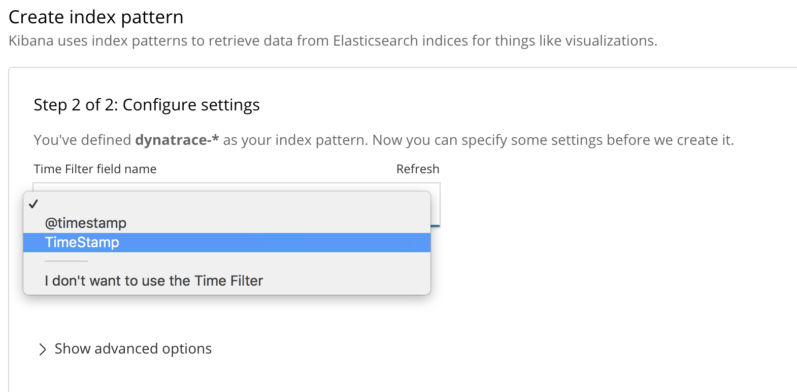

# Integration of *dynatrace* reporting aggregation into elastic

## Required tools 

This workshop has been accomplished all in eclipse:

- eclipse with ruby plugin, xalan plugin and xml plugin.
- [ruby xslt](https://github.com/glejeune/ruby-xslt)

## Description of the problem

How to integrate a **file** coming from the extraction of dynatrace aggregated statistics, such as [here for details](./dynatrace.xml), here is a snippet

```xml
<dashboardreport name="test-RichClient7.0_TRIAL_20181130" version="7.0.14.1013" reportdate="2018-02-02T16:13:43.135-05:00" description="">
  <source name="TRIAL Dummy">
    <filters summary="last 7 days">
      <filter>tf:Last7d</filter>
    </filters>
  </source>
  <reportheader>
    <reportdetails>
      <user>Joe Do</user>
    </reportdetails>
  </reportheader>
  <data>
    <chartdashlet name="Chart" description="" showabsolutevalues="false">
      <source>
        <filters summary="from 2017-11-14 14:45 to 2017-11-18 02:45">
          <filter>tf:CustomTimeframe?1510688748304:1510991148304</filter>
        </filters>
      </source>
      <measures structuretype="tree">
        <measure measure="TRIAL Attach File to Case - TRIAL Attach File to Case (split by Application)" color="#804000" aggregation="Count" unit="num" thresholds="false" drawingorder="2">
          <measure measure="TRIAL Attach File to Case - TRIAL Dummy" color="#f2e7a6" aggregation="Count" unit="num" thresholds="false">
            <measurement timestamp="1510722000000" avg="1255.7346063912705" min="17.810747146606445" max="15378.7333984375" sum="1611107.5" count="1283"></measurement>
            <measurement timestamp="1510808400000" avg="1364.9752635847526" min="47.586570739746094" max="8342.779296875" sum="1683014.5" count="1233"></measurement>
            <measurement timestamp="1510894800000" avg="1574.1275022747952" min="24.8994197845459" max="36158.0625" sum="1729966.125" count="1099"></measurement>
            <measurement timestamp="1510981200000" avg="1785.78759765625" min="1075.2763671875" max="2588.27978515625" sum="10714.7255859375" count="6"></measurement>
          </measure>
        </measure>
        <measure measure="TRIAL Attach File to Case - TRIAL Attach File to Case (split by Application)" color="#804000" aggregation="95th Percentile" unit="ms" thresholds="false" drawingorder="1">
          <measure measure="TRIAL Attach File to Case - TRIAL Dummy" color="#4d73e5" aggregation="95th Percentile" unit="ms" thresholds="false">
            <measurement timestamp="1510722000000" avg="2923.011962890625" min="2923.011962890625" max="2923.011962890625" sum="2923.011962890625" count="1288"></measurement>
            <measurement timestamp="1510808400000" avg="3124.757080078125" min="3124.757080078125" max="3124.757080078125" sum="3124.757080078125" count="1233"></measurement>
            <measurement timestamp="1510894800000" avg="2692.88232421875" min="2692.88232421875" max="2692.88232421875" sum="2692.88232421875" count="1099"></measurement>
            <measurement timestamp="1510981200000" avg="1765.0831298828125" min="1765.0831298828125" max="1765.0831298828125" sum="1765.0831298828125" count="6"></measurement>
          </measure>
        </measure>
      </measures>
    </chartdashlet>
    <chartdashlet name="Chart" description="" showabsolutevalues="false">
      <source>
        <filters summary="last 7 days">
          <filter>tf:Last7d</filter>
        </filters>
      </source>
      <measures structuretype="tree">
        <measure measure="TRIAL Open Work Item by Handle - TRIAL Open Work Item by Handle (split by Application)" color="#804000" aggregation="Count" unit="num" thresholds="false" drawingorder="2">
          <measure measure="TRIAL Open Work Item by Handle - TRIAL Dummy" color="#143085" aggregation="Count" unit="num" thresholds="false">
            <measurement timestamp="1517007600000" avg="357.03397487153944" min="185.43829345703125" max="6806.4931640625" sum="106396.12451171875" count="298"></measurement>
            <measurement timestamp="1517029200000" avg="7011.71328125" min="319.715087890625" max="21073.587890625" sum="35058.56640625" count="5"></measurement>
            <measurement timestamp="1517050800000" avg="613.9712068256579" min="167.7206268310547" max="11482.5390625" sum="116654.529296875" count="190"></measurement>
            <measurement timestamp="1517072400000" avg="421.24826204978814" min="52.342044830322266" max="19486.615234375" sum="99414.58984375" count="236"></measurement>
            <measurement timestamp="1517094000000" avg="355.8650764016544" min="208.74412536621094" max="1536.4691162109375" sum="6049.706298828125" count="17"></measurement>
            <measurement timestamp="1517137200000" avg="377.6945511390423" min="167.09332275390625" max="3922.95068359375" sum="21906.283966064453" count="58"></measurement>

<HAS BEEN CUT>

```

> In my conversation with my colleague who was attempting to integrate the data here above, it was apparent to me that if the problem is to integrate a xml file into elastic through logstash, there maybe other solution than trying hard to solve the problem with all the various logstash tools available like ruby, xml/xpath plugin. This is not to say that logstash is not able to manage it, I am a fan of the eco-system that I consider as important as elastic engine itself.

Here is the approach we have adopted to solve the problem :

- As our source file is a xml, why not trying to use xslt to get our file in order first.
- If we were to transform the xml file before hitting logstash, we may want to avoid using the multiline codec as much as possible with our new transformed file as it was done [here](../../logstash-xml.md). In order to achieve the smoothest ingest process, the data could be de-normalize in such a way that the relevant context is carry along with each record (e.g. user, report title).
- then we can let anyone creating the pipeline to grab the file, transform it and then ingesting it into logstash. A quick ruby program will highlight how to invoke xslt on the filr first, from there anyone can build the pipeline (push, pull, scheduling etc ...).

## XSLT transformation

The transformation is quite straight forward, only point to notice is the 3 nested *for-each* loop to navigate the xml as well as the global variables being used to implement the de-normalization of the data. 

> Note: we have decided that we will not use any auto-formating feature from xslt, We wpoiuld like to keep the control on what will go on one line in order to control the way logstash will process the file. Without using the multiline codec, logstash process any text filr by considering one line as a record, in that respect, we need to make sure that the transformation process in xslt does not split line in an undesire way.


```xslt
<?xml version="1.0" encoding="UTF-8"?>
<!-- 2018 rumi -->
<xsl:stylesheet version="1.0"
	xmlns:xsl="http://www.w3.org/1999/XSL/Transform">

	<xsl:variable name="newline">
		<xsl:text>
</xsl:text>
	</xsl:variable>
	<xsl:template match="/">
		<xsl:variable name="dashname" select="dashboardreport/@name" />
		<xsl:variable name="user"
			select="dashboardreport/reportheader/reportdetails/user/text()" />
		<xsl:for-each select="dashboardreport/data/chartdashlet/measures/measure">
			<xsl:for-each select="measure">
				<xsl:variable name="aggregation" select="@aggregation" />
				<xsl:variable name="unit" select="@unit" />
				<xsl:for-each select="measurement">
					<xsl:copy>
						<xsl:copy-of select="$dashname" />
						<xsl:attribute name="user">
							<xsl:copy-of select="$user" />
						</xsl:attribute>
						<xsl:copy-of select="@*" />
						<xsl:copy-of select="$aggregation" />
						<xsl:copy-of select="$unit" />
					</xsl:copy>
					<xsl:value-of select="$newline" />
				</xsl:for-each>
			</xsl:for-each>
		</xsl:for-each>
	</xsl:template>
</xsl:stylesheet>
```

### Running xslt from eclipse is easy

From the editor, right mouse click then click on Run As -> Run Configuration like here under


Then you you can create a new configuration and fill the blank as described below :


> Note : you can eother use the eclipse native xslt processor or take Xalan ( :heart_eyes:)


### Running xslt from Ruby script

> Note you can do like me, use eclipse as a REAL IDE ( :stuck_out_tongue_winking_eye:), as example here are the perspective I use simultaneously in eclipse. It has been proven to me very stable overtime and very convenient when managing many different kind of technology. 


```ruby

# 2018 rumi
require 'xml/xslt'

xslt = XML::XSLT.new()
xslt.xml = "dynatrace.xml"
xslt.xsl = "dynatrace.xsl"

out = xslt.serve()
print out;

```

>Note 

## The result

The result is just a series of one line record in xml format, beautifully formatted to go straight to logstash.

```xml
<?xml version="1.0" encoding="UTF-8"?><measurement name="test-RichClient7.0_TRIAL_20181130" user="Joe Do" timestamp="1510722000000" avg="1255.7346063912705" min="17.810747146606445" max="15378.7333984375" sum="1611107.5" count="1283" aggregation="Count" unit="num"/>
<measurement name="test-RichClient7.0_TRIAL_20181130" user="Joe Do" timestamp="1510808400000" avg="1364.9752635847526" min="47.586570739746094" max="8342.779296875" sum="1683014.5" count="1233" aggregation="Count" unit="num"/>
<measurement name="test-RichClient7.0_TRIAL_20181130" user="Joe Do" timestamp="1510894800000" avg="1574.1275022747952" min="24.8994197845459" max="36158.0625" sum="1729966.125" count="1099" aggregation="Count" unit="num"/>
<measurement name="test-RichClient7.0_TRIAL_20181130" user="Joe Do" timestamp="1510981200000" avg="1785.78759765625" min="1075.2763671875" max="2588.27978515625" sum="10714.7255859375" count="6" aggregation="Count" unit="num"/>
<measurement name="test-RichClient7.0_TRIAL_20181130" user="Joe Do" timestamp="1510722000000" avg="2923.011962890625" min="2923.011962890625" max="2923.011962890625" sum="2923.011962890625" count="1288" aggregation="95th Percentile" unit="ms"/>
<measurement name="test-RichClient7.0_TRIAL_20181130" user="Joe Do" timestamp="1510808400000" avg="3124.757080078125" min="3124.757080078125" max="3124.757080078125" sum="3124.757080078125" count="1233" aggregation="95th Percentile" unit="ms"/>
<measurement name="test-RichClient7.0_TRIAL_20181130" user="Joe Do" timestamp="1510894800000" avg="2692.88232421875" min="2692.88232421875" max="2692.88232421875" sum="2692.88232421875" count="1099" aggregation="95th Percentile" unit="ms"/>
<measurement name="test-RichClient7.0_TRIAL_20181130" user="Joe Do" timestamp="1510981200000" avg="1765.0831298828125" min="1765.0831298828125" max="1765.0831298828125" sum="1765.0831298828125" count="6" aggregation="95th Percentile" unit="ms"/>
<measurement name="test-RichClient7.0_TRIAL_20181130" user="Joe Do" timestamp="1517007600000" avg="357.03397487153944" min="185.43829345703125" max="6806.4931640625" sum="106396.12451171875" count="298" aggregation="Count" unit="num"/>
<measurement name="test-RichClient7.0_TRIAL_20181130" user="Joe Do" timestamp="1517029200000" avg="7011.71328125" min="319.715087890625" max="21073.587890625" sum="35058.56640625" count="5" aggregation="Count" unit="num"/>
<measurement name="test-RichClient7.0_TRIAL_20181130" user="Joe Do" timestamp="1517050800000" avg="613.9712068256579" min="167.7206268310547" max="11482.5390625" sum="116654.529296875" count="190" aggregation="Count" unit="num"/>
<measurement name="test-RichClient7.0_TRIAL_20181130" user="Joe Do" timestamp="1517072400000" avg="421.24826204978814" min="52.342044830322266" max="19486.615234375" sum="99414.58984375" count="236" aggregation="Count" unit="num"/>
<measurement name="test-RichClient7.0_TRIAL_20181130" user="Joe Do" timestamp="1517094000000" avg="355.8650764016544" min="208.74412536621094" max="1536.4691162109375" sum="6049.706298828125" count="17" aggregation="Count" unit="num"/>
<measurement name="test-RichClient7.0_TRIAL_20181130" user="Joe Do" timestamp="1517137200000" avg="377.6945511390423" min="167.09332275390625" max="3922.95068359375" sum="21906.283966064453" count="58" aggregation="Count" unit="num"/>
<measurement name="test-RichClient7.0_TRIAL_20181130" user="Joe Do" timestamp="1517158800000" avg="392.81637739701705" min="168.7490692138672" max="12417.1982421875" sum="86419.60302734375" count="220" aggregation="Count" unit="num"/>
<measurement name="test-RichClient7.0_TRIAL_20181130" user="Joe Do" timestamp="1517180400000" avg="432.8554992675781" min="335.8668518066406" max="542.0620727539062" sum="1298.5664978027344" count="3" aggregation="Count" unit="num"/>
<measurement name="test-RichClient7.0_TRIAL_20181130" user="Joe Do" timestamp="1517202000000" avg="339.30517578125" min="289.1710205078125" max="436.0088195800781" sum="1696.52587890625" count="5" aggregation="Count" unit="num"/>
<measurement name="test-RichClient7.0_TRIAL_20181130" user="Joe Do" timestamp="1517223600000" avg="494.6912931995259" min="5.351944923400879" max="140278.15625" sum="2195934.6505126953" count="4439" aggregation="Count" unit="num"/>
<measurement name="test-RichClient7.0_TRIAL_20181130" user="Joe Do" timestamp="1517245200000" avg="489.8069825351344" min="18.695018768310547" max="140288.3125" sum="3589795.375" count="7329" aggregation="Count" unit="num"/>
<measurement name="test-RichClient7.0_TRIAL_20181130" user="Joe Do" timestamp="1517266800000" avg="478.64735061453973" min="192.24964904785156" max="14711.0693359375" sum="228793.43359375" count="478" aggregation="Count" unit="num"/>
```


## Logstash configuration

As the file has been well prepared, it is easy to ingest with logstash by using the xml plugin as well as date plugin.

```
# rumi 2018

input {
file {
    path => [ "${INPUTDIRECTORY}/dynatrace.out.xml" ]
    start_position => "beginning"
    sincedb_path => "/dev/null"
    type => "dynatrace"
         }
  }
filter {
      xml {
        store_xml => "true"
        source => "message"
	force_array => false
    	target => "xml_content"
	remove_namespaces => true
	xpath => ["measurement/@timestamp","TS"]
       }

date {
        match => ["TS[0]","UNIX_MS"]
        target => "TimeStamp"
    }


    }

output {
    elasticsearch { 
        hosts => "http://${ELKMASTERHOSTNAME:mbp15.local}:${ELKMASTERPORT:9200}"
        index => "%{type}-%{+YYYY.MM.dd}"
        user => elastic
        password => "${ES_PWD}"
    }
  stdout { codec => rubydebug }
}


```

## Kibana Index Pattern

> Note : as highlighted in the previous section on logstash configuration, we have now created an index in elasticsearch that has not only the meta data *@timestamp* which is the time when the record gets into elastic, we have now another sort of timestamp that we have called *TimeStamp* which is the time and date when dynatrace generated its line of statistic called *measurement*.

Let's create the index pattern as follow :





## Kibana Visualization


