<!-- TOC -->

- [*filebeat* Samples](#filebeat-samples)
    - [Context](#context)
    - [Performance *filebeat* : ingesting 10000 files](#performance-filebeat--ingesting-10000-files)
        - [Use case #1 : 1 worker, default bulk size](#use-case-1--1-worker-default-bulk-size)
            - [Profile](#profile)
            - [Elastic performance](#elastic-performance)
            - [Filebeat performance](#filebeat-performance)
        - [Use case #2 : 20 workers,  bulk size 5000](#use-case-2--20-workers--bulk-size-5000)
            - [Profile](#profile-1)
            - [Elastic performance](#elastic-performance-1)
            - [Filebeat performance](#filebeat-performance-1)
        - [Use case #3 : 20 worker, bulk size unlimited (aka higher than # of records to ingest)](#use-case-3--20-worker-bulk-size-unlimited-aka-higher-than--of-records-to-ingest)
            - [Profile](#profile-2)
            - [Elastic performance](#elastic-performance-2)
            - [Filebeat performance](#filebeat-performance-2)
        - [Use case #4 : same as before but running more than one filebeat or more than one prospector](#use-case-4--same-as-before-but-running-more-than-one-filebeat-or-more-than-one-prospector)
            - [Profile](#profile-3)
            - [Filebeat performance](#filebeat-performance-3)
            - [Tuning the number of workers](#tuning-the-number-of-workers)
        - [Use case #5 : aggregating the files using unix script than ingesting the consolidated file.](#use-case-5--aggregating-the-files-using-unix-script-than-ingesting-the-consolidated-file)
            - [one worker and bulk_size 50](#one-worker-and-bulk_size-50)
                - [Profile](#profile-4)
                - [Filebeat performance](#filebeat-performance-4)
            - [4 worker and bulk_size 50](#4-worker-and-bulk_size-50)
                - [Profile](#profile-5)
                - [Filebeat performance](#filebeat-performance-5)
            - [16 worker and bulk_size 50](#16-worker-and-bulk_size-50)
                - [Profile](#profile-6)
                - [Filebeat performance](#filebeat-performance-6)
            - [32 worker and bulk_size 50](#32-worker-and-bulk_size-50)
                - [Profile](#profile-7)
                - [Filebeat performance](#filebeat-performance-7)
            - [Side by Side](#side-by-side)
                - [Profile](#profile-8)
                - [Filebeat performance](#filebeat-performance-8)
            - [Varying Bulk_size with 4-16 workers](#varying-bulk_size-with-4-16-workers)
                - [Profile](#profile-9)
                - [Filebeat performance](#filebeat-performance-9)
    - [Configuration file and tools](#configuration-file-and-tools)
        - [Generate 10000 files easily](#generate-10000-files-easily)
        - [Concatenate 10000 files into one easily](#concatenate-10000-files-into-one-easily)
        - [Configuration files](#configuration-files)

<!-- /TOC -->

# *filebeat* Samples

## Context

One of the problem that we face is how to push a high number of files into elasticseach. The number of file can reach more than 10000 files which are not necessarily big. In our case, the files were generated by jenkins but it can be whatever other use case. Here below we will go through several test to explore how we can leverage filebeat and try to tune it and see whether ingesting lot of files is a good case to address with filebeat.

## Performance *filebeat* : ingesting 10000 files

use case 10000 files of 32k each

### Use case #1 : 1 worker, default bulk size

#### Profile

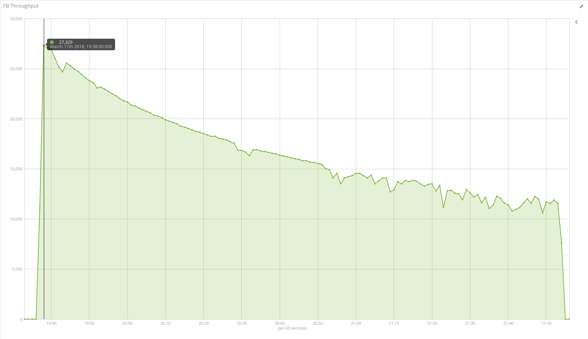

#### Elastic performance

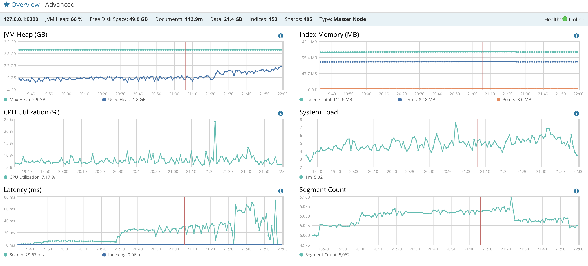

#### Filebeat performance

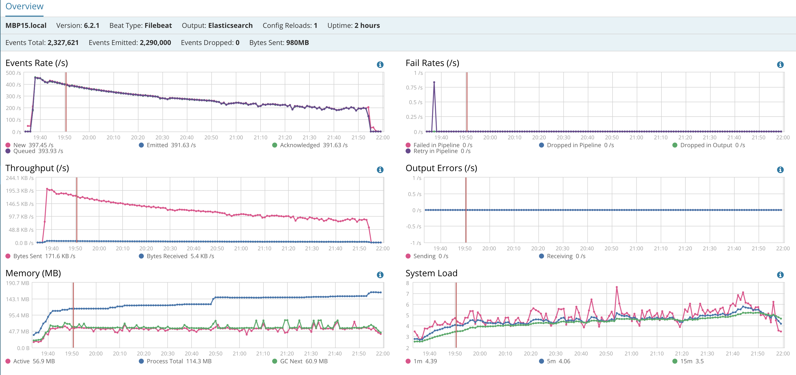

### Use case #2 : 20 workers,  bulk size 5000

#### Profile


#### Elastic performance

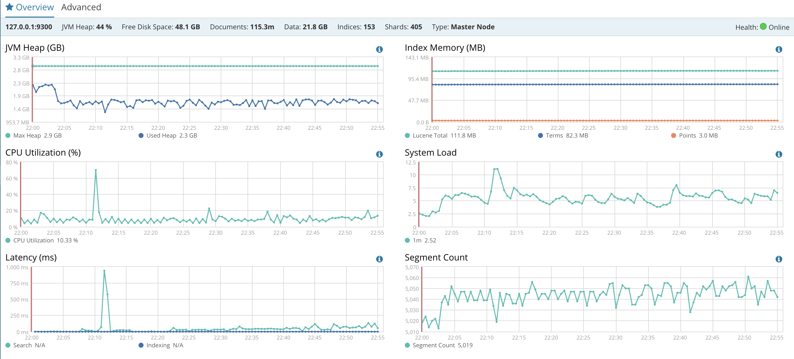

#### Filebeat performance

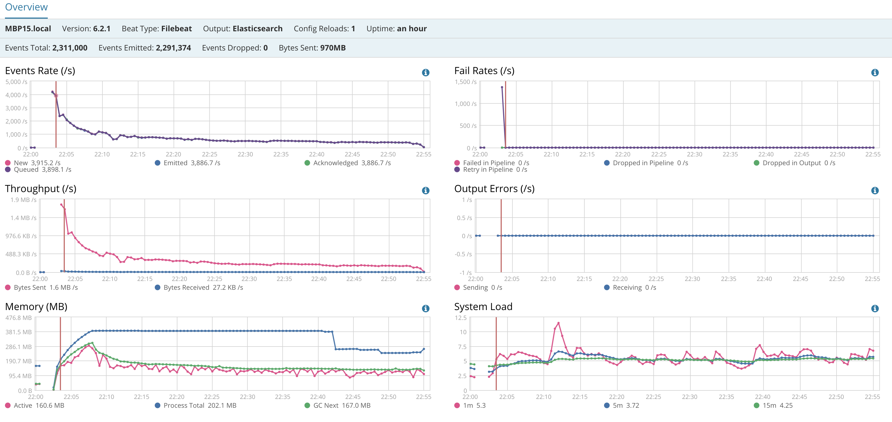

### Use case #3 : 20 worker, bulk size unlimited (aka higher than # of records to ingest)

here is an example

```yaml
#slow down scan_frequency
  scan_frequency: 5m
# slow down how often to check if the file has been updated.
  backoff: 5m
  max_backoff: 1h
# number of file harvest at the same time
  harvester_limit: 0
# close the file when reaching EOF
  close_eof: true
# close file when being inactive for 1 min
  close_inactive: 1m
```

#### Profile


#### Elastic performance

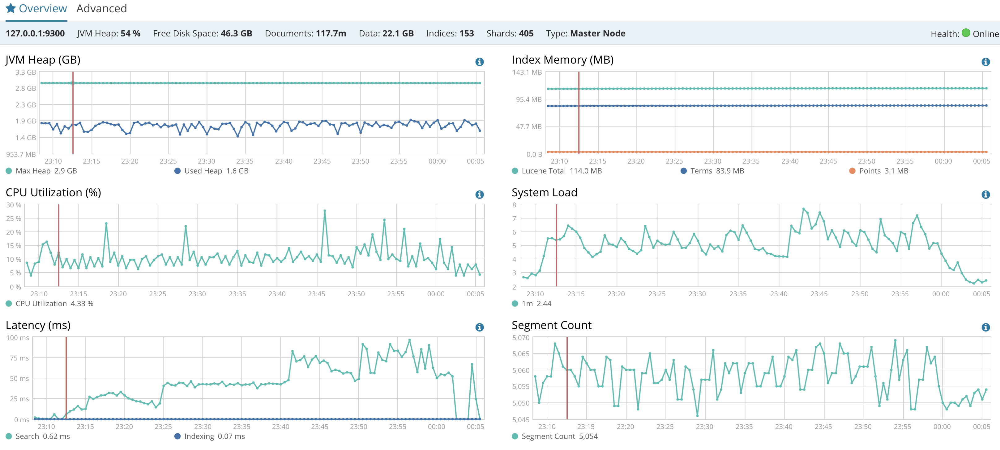

#### Filebeat performance

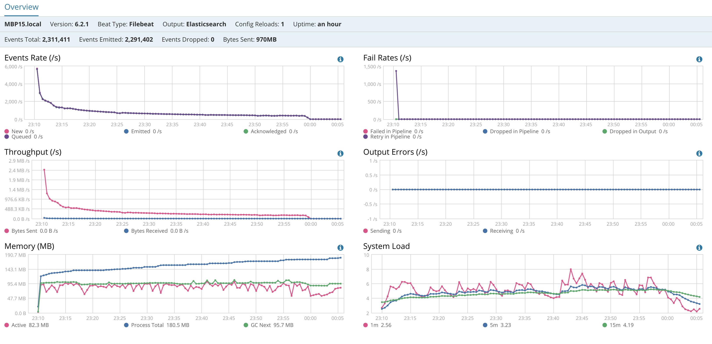

### Use case #4 : same as before but running more than one filebeat or more than one prospector

In an attempt to improve filebeat performance, the test below summarizes the result with 2, 3 filebeats running as well as running multiple prospectors to see if filebeat scales well when segregating on multiple prospectors. Read the chart and draw your own conclusion. 

#### Profile

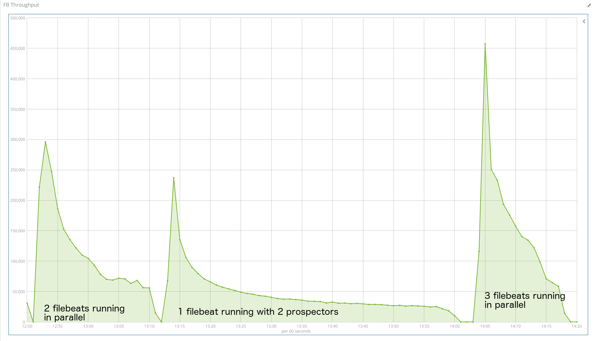

#### Filebeat performance


#### Tuning the number of workers

The test have been made wit h20 workers however increasing the number may not necessarily be the solution, it will depends on various factors, for that it is recommended to test several options. As example, even though all test have been done wit h20 workers, here is an example side by side with running 3 filebeats, on the left with 4 workers each while on the right with 20 workers each, there is no difference on the overall runtime even though 20 workers start faster and peak higher :

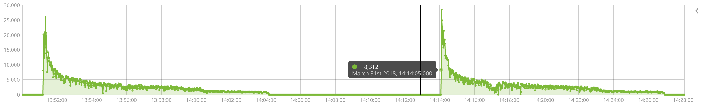

### Use case #5 : aggregating the files using unix script than ingesting the consolidated file.

#### one worker and bulk_size 50

##### Profile

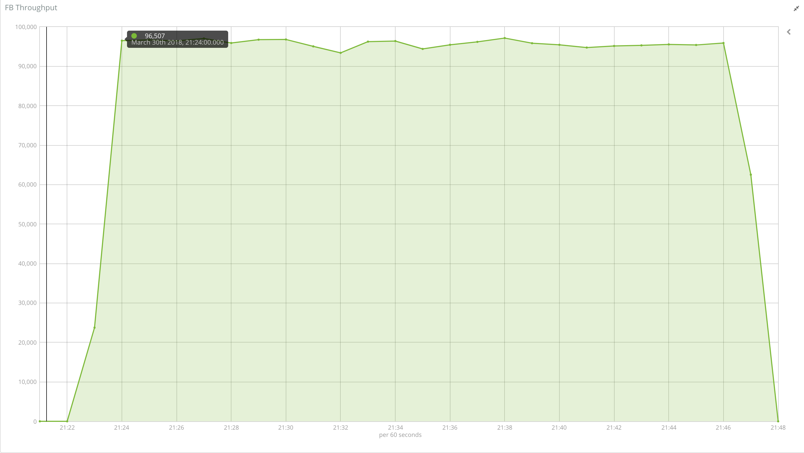

##### Filebeat performance


#### 4 worker and bulk_size 50

##### Profile


##### Filebeat performance

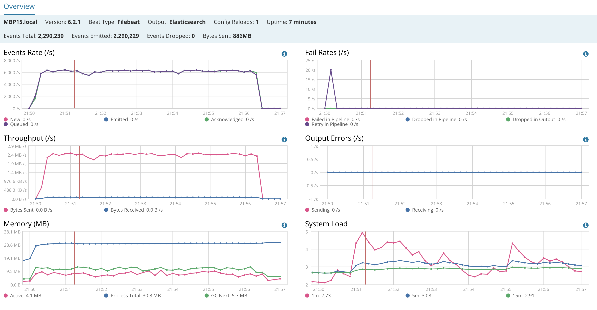

#### 16 worker and bulk_size 50

##### Profile


##### Filebeat performance

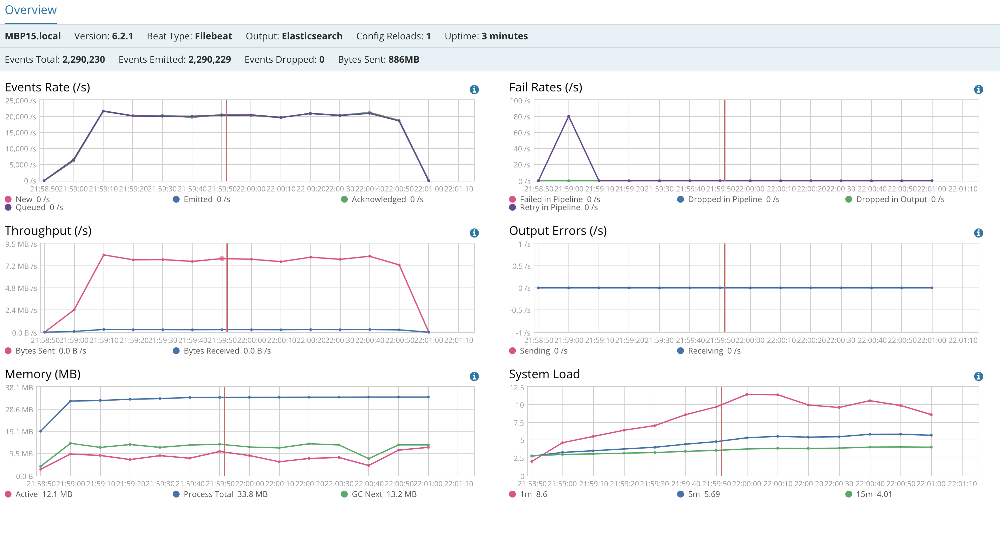

#### 32 worker and bulk_size 50

##### Profile


##### Filebeat performance

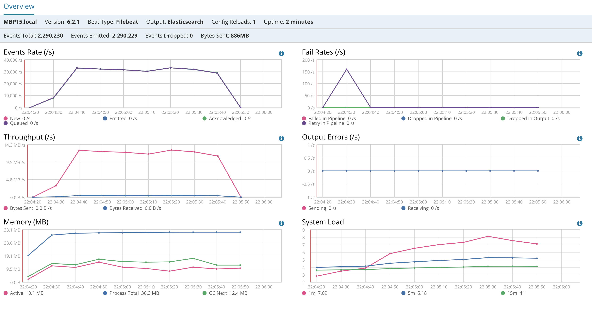

#### Side by Side

##### Profile


##### Filebeat performance

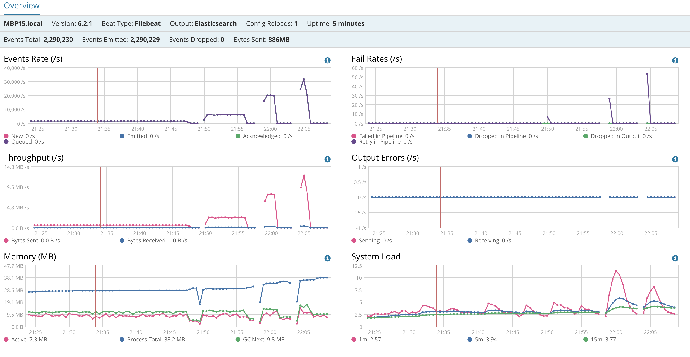

#### Varying Bulk_size with 4-16 workers

##### Profile


##### Filebeat performance

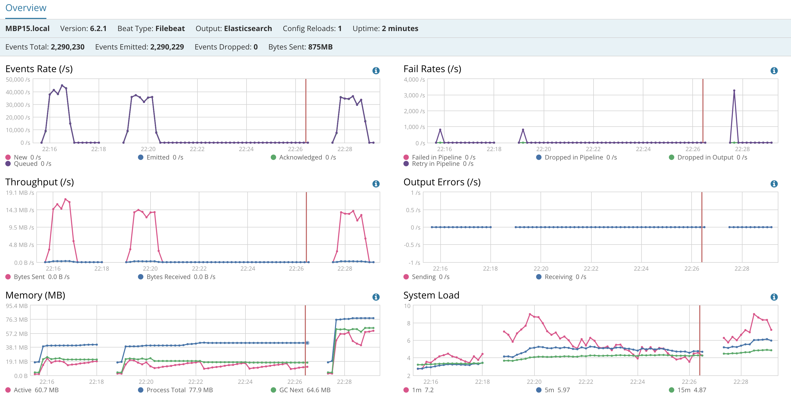

## Configuration file and tools

### Generate 10000 files easily

Here is a basic script that allows to create copies from an existing file. This script has been used to created 10000 files from the same file. There are many other ways to do here is one way.

Script here under or [here](./src/duplicates_files.sh)

```bash
#!/usr/bin/env bash
# rumi 2018

# usage : duplicates_files.sh <file>
# generate in the same folder as <file> 10000 files like <file><number from 1 to 10000> 
usage()
{
    echo "usage: duplicates_files.sh [-f <file>] [-n <number of file to create:default 10>]| [-h]]"
}

NUMBER_OF_COPY=10 #Default value

while [ "$1" != "" ]; do
    case $1 in
        -f | --file )		shift
				INPUTFILE=$1
                                ;;
        -n | --number-of-copy ) shift
				NUMBER_OF_COPY=$1
                                ;;
        -h | --help )           usage
                                exit
                                ;;
        * )                     usage
                                exit 1
    esac
    shift
done

for (( i=1; i<=$NUMBER_OF_COPY; i++))
	do
		echo -ne "Number $i  $INPUTFILE$i \r"
		cp $INPUTFILE $INPUTFILE$i
	done
echo -e "\n\ndone !"
```

### Concatenate 10000 files into one easily

In order to compare the capabilities of filebeat by processing 10000 files or the aggregation of the 10000 files into one, here is a simple script that concatenate the 10000 files :

```bash
#!/usr/bin/env bash 
# rumi 2018
# catall.sh <arg1> <arg2>
# <arg1> : path where all files need to be aggregated
# <arg2> : targetfile to contain all aggregated files from path in <arg1>

timestamp=$(date +%s)

echo "source directory $1 ..."

basetime=$(date +%s)
ls -l1 $1| xargs -P8 -I file cat $1/file > $2
totaltime=$(echo "($(date +%s) - ${basetime})" | bc)
echo "runtime: ${totaltime} seconds"
```


### Configuration files

Several configuration files have been provided [here](./conf) and have been used the following way :

- Launching 1 filebeat with 2 prospectors by using `filebeat.yml`
- Launching 2 filebeats by using file `filebeat0-4.yml` and `filebeat5-9.yml`
- Launching 3 filebeats by using file `filebeat0-3.yml`, `filebeat4-6.yml` and `filebeat7-9.yml`
- Launching 1 filebeat by using `filebeat-single-file.yml` and varying number of `workers`s and `bulk_size`.

Those files are just provided for the record, there is nothing special here, just change and edit them and test how filebeat react. 
