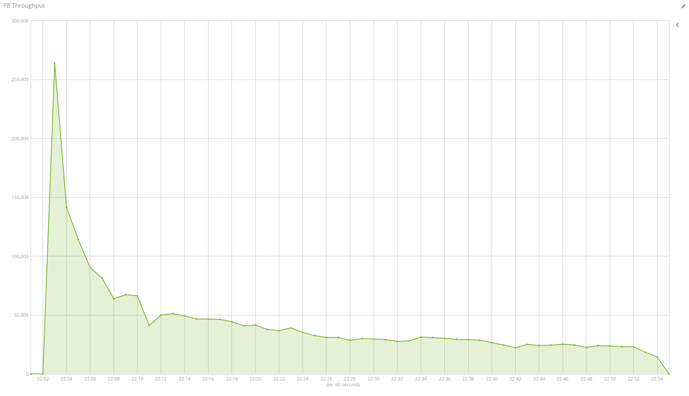
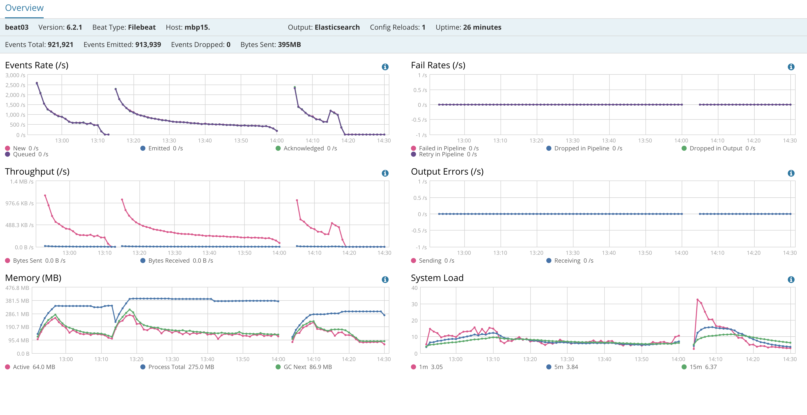

# *filebeat* Samples

## Performance *filebeat* : ingesting 10000 files

use case 10000 files of 32k each


### use case #1 : 1 worker, default bulk size

#### Profile


#### Elastic performance


#### Filebeat performance


### use case #2 : 20 workers,  bulk size 5000

#### Profile




#### Elastic performance


#### Filebeat performance


### use case #3 : 20 worker, bulk size unlimited (aka higher than # of records to ingest).

```
#slow down scan_frequency
  scan_frequency: 5m
# slow down how often to check if the file has been updated.
  backoff: 5m
  max_backoff: 1h
# number of file harvest at the same time
  harvester_limit: 0
# close the file when reaching EOF
  close_eof: true
```

#### Profile


#### Elastic performance


#### Filebeat performance


# use case #4 : same as before but running more than one filebeat

In an attempt to improve filebeat performance, the test below summarizes the result with 2, 3 filebeats running as well as running multiple prospectors to see if filebeat sacales well when seggregating on multiple prospectors. Read the chart and draw your own conclusion. 

#### Profile


#### Filebeat performance




