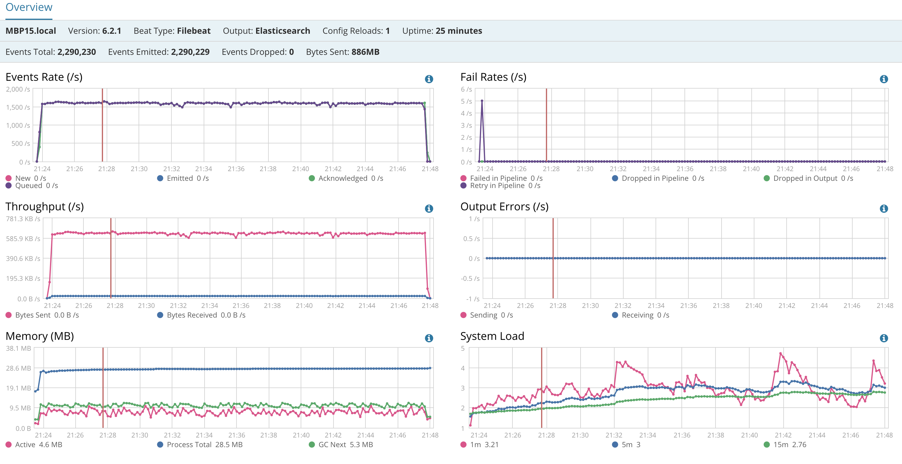
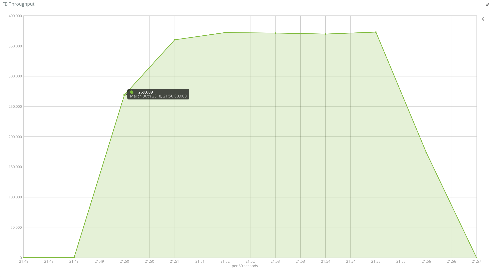
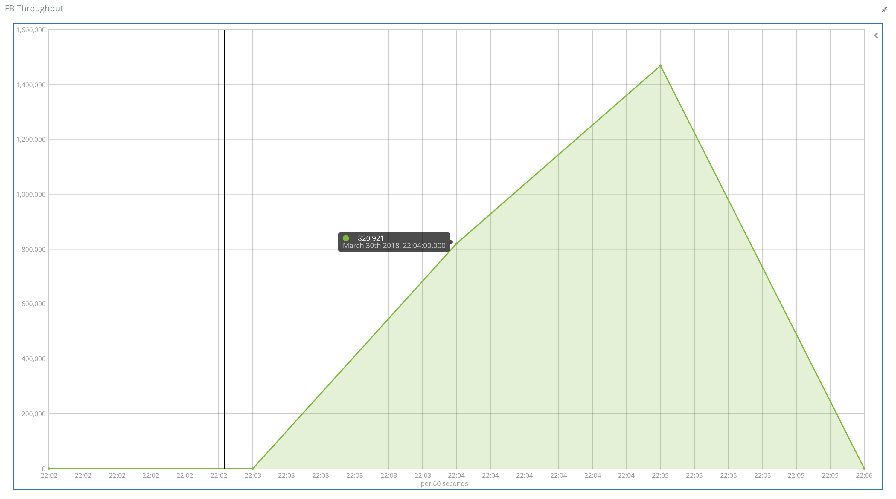
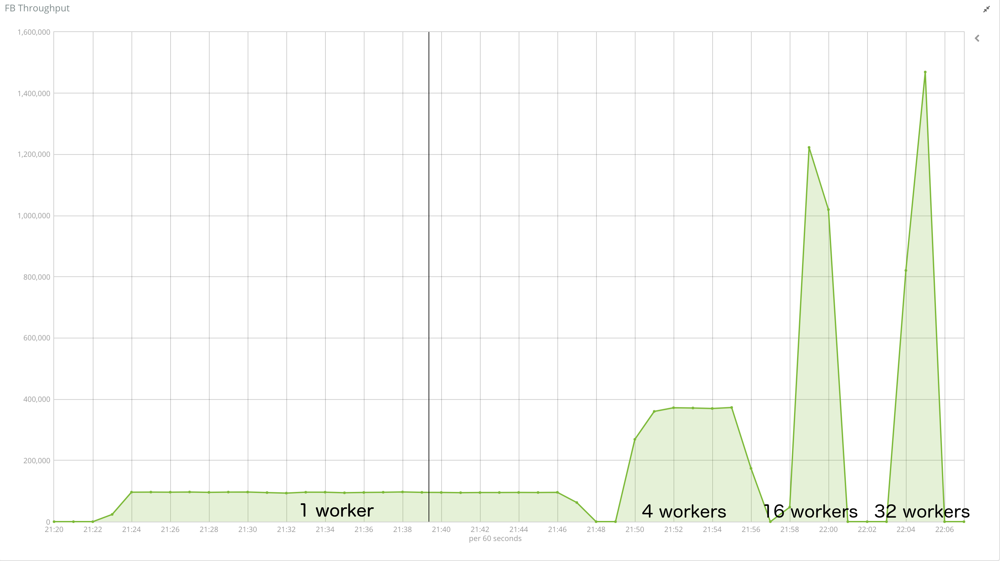

<!-- TOC -->

- [*filebeat* Samples](#filebeat-samples)
    - [Context](#context)
    - [Performance *filebeat* : ingesting 10000 files](#performance-filebeat--ingesting-10000-files)
        - [Use case #1 : 1 worker, default bulk size](#use-case-1--1-worker-default-bulk-size)
            - [Profile](#profile)
            - [Elastic performance](#elastic-performance)
            - [Filebeat performance](#filebeat-performance)
        - [Use case #2 : 20 workers,  bulk size 5000](#use-case-2--20-workers--bulk-size-5000)
            - [Profile](#profile-1)
            - [Elastic performance](#elastic-performance-1)
            - [Filebeat performance](#filebeat-performance-1)
        - [Use case #3 : 20 worker, bulk size unlimited (aka higher than # of records to ingest)](#use-case-3--20-worker-bulk-size-unlimited-aka-higher-than--of-records-to-ingest)
            - [Profile](#profile-2)
            - [Elastic performance](#elastic-performance-2)
            - [Filebeat performance](#filebeat-performance-2)
        - [Use case #4 : same as before but running more than one filebeat or more than one prospector](#use-case-4--same-as-before-but-running-more-than-one-filebeat-or-more-than-one-prospector)
            - [Profile](#profile-3)
            - [Filebeat performance](#filebeat-performance-3)
        - [Use case #5 : aggregating the files using unix script than ingesting the consolidated file.](#use-case-5--aggregating-the-files-using-unix-script-than-ingesting-the-consolidated-file)
            - [one worker and bulk_size 50](#one-worker-and-bulk_size-50)
                - [Profile](#profile-4)
                - [Filebeat performance](#filebeat-performance-4)
            - [worker and bulk_size 50](#worker-and-bulk_size-50)
                - [Profile](#profile-5)
                - [Filebeat performance](#filebeat-performance-5)
            - [worker and bulk_size 50](#worker-and-bulk_size-50-1)
                - [Profile](#profile-6)
                - [Filebeat performance](#filebeat-performance-6)
            - [worker and bulk_size 50](#worker-and-bulk_size-50-2)
                - [Profile](#profile-7)
                - [Filebeat performance](#filebeat-performance-7)
            - [Side by Side](#side-by-side)
                - [Profile](#profile-8)
                - [Filebeat performance](#filebeat-performance-8)
            - [Varying Bulk_size with 4-16 workers](#varying-bulk_size-with-4-16-workers)
                - [Profile](#profile-9)
                - [Filebeat performance](#filebeat-performance-9)

<!-- /TOC -->

# *filebeat* Samples

## Context

One of the problem that we face is how to push a high number of files into elasticseach. The number of file can reach more than 10000 files which are not necessarily big. In our case, the files were generated by jenkins but it can be whatever other use case. Here below we will go through several test to explore how we can leverage filebeat and try to tune it and see whether ingesting lot of files is a good case to address with filebeat.

## Performance *filebeat* : ingesting 10000 files

use case 10000 files of 32k each

### Use case #1 : 1 worker, default bulk size

#### Profile


#### Elastic performance


#### Filebeat performance


### Use case #2 : 20 workers,  bulk size 5000

#### Profile


#### Elastic performance


#### Filebeat performance


### Use case #3 : 20 worker, bulk size unlimited (aka higher than # of records to ingest)

here is an example

```yaml
#slow down scan_frequency
  scan_frequency: 5m
# slow down how often to check if the file has been updated.
  backoff: 5m
  max_backoff: 1h
# number of file harvest at the same time
  harvester_limit: 0
# close the file when reaching EOF
  close_eof: true
# close file when being inactive for 1 min
  close_inactive: 1m
```

#### Profile


#### Elastic performance


#### Filebeat performance


### Use case #4 : same as before but running more than one filebeat or more than one prospector

In an attempt to improve filebeat performance, the test below summarizes the result with 2, 3 filebeats running as well as running multiple prospectors to see if filebeat scales well when segregating on multiple prospectors. Read the chart and draw your own conclusion. 

#### Profile


#### Filebeat performance


### Use case #5 : aggregating the files using unix script than ingesting the consolidated file.

#### one worker and bulk_size 50

##### Profile


##### Filebeat performance



#### worker and bulk_size 50

##### Profile



##### Filebeat performance


#### worker and bulk_size 50

##### Profile


##### Filebeat performance


#### worker and bulk_size 50

##### Profile



##### Filebeat performance


#### Side by Side

##### Profile



##### Filebeat performance


#### Varying Bulk_size with 4-16 workers

##### Profile


##### Filebeat performance

