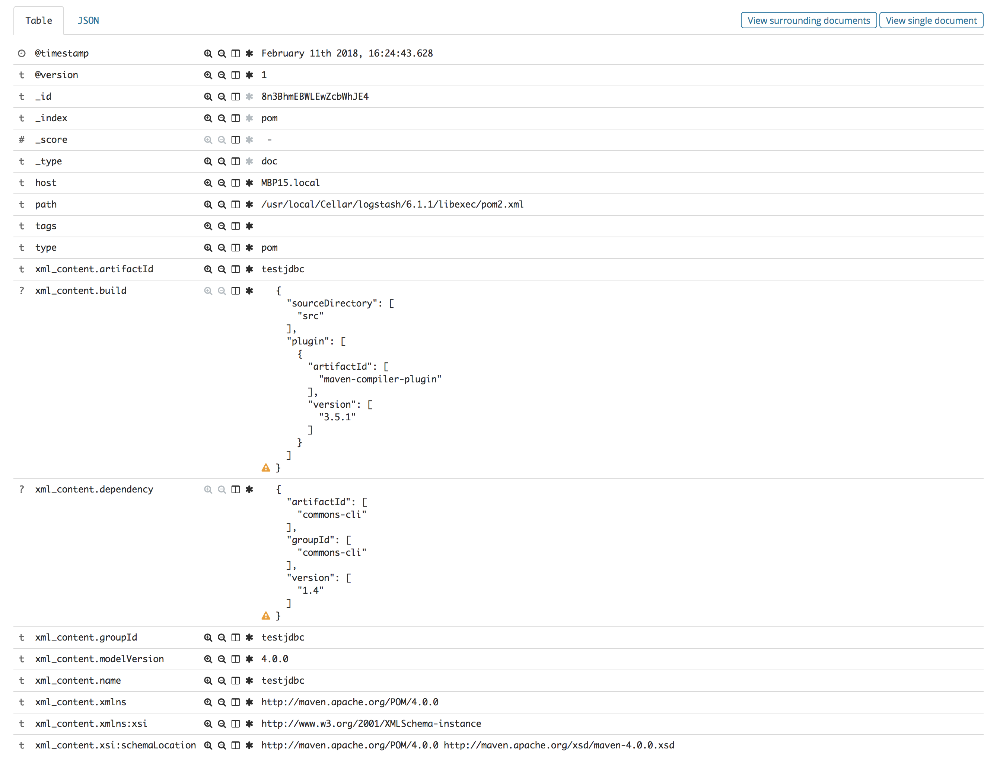

# Ingest xml file into Elasticsearch through logstash

> Any xml file is made of several lines, XML is just information wrapped in tags. 

[XML Tutorial link](https://www.w3schools.com/xml/default.asp)

## Problem statement

How can we push a xml file into elasticsearch in such a way that one xml file is cointained in one document or one record or elasticsesarch. However if one try to push any xml file as follow (file [here](./conf/logstash-xml-false.conf), elastic will create a record for each line :

```
input {
	file {
	    path => [ "/usr/local/Cellar/logstash/6.1.1/libexec/pom2.xml" ]
	    type => "pom"    
	}
}
filter { }
output {
    elasticsearch { 
       hosts => hosts => "http://${ELKMASTERHOSTNAME}:${ELKMASTERPORT}"
       index => "pom"
    }
  stdout { codec => rubydebug }
}
```

Then you can call logstash as follow :

```
bin/logstash -f logstash-xml-false.conf
```

here are few lines of the execution console :


Here is the result for few lines in kibana :


This is not really practical to dump each line of a xml file into one elastic record; it will still offer a good search capability on a dump of data but it is at cost. Let's have a look at how we can provide a better solution but first let's review the core principle of logstash.

## Logstash pipeline

Logstash is made of three parts : input, filter and output. In essence logstash works like a pipeline or a conduite to elastic. it means that in the case of a *text* file, each line of the file is considered as an individual record being push through the pipeline. Therefore each record will be process through the sequence **input -> filter -> output**.

## The solution leveraging logstash plugin and codec.

### Step1 : repackage the xml to be consumed as one record

#### Logstash multiline codec

here is the solution but prior to that make sure you have loaded the plugin using the following command  :

```
> bin/logstash-plugin install logstash-codec-multiline
```
Here is the approach :

```
file {
    path => [ "/usr/local/Cellar/logstash/6.1.1/libexec/pom2.xml" ]
    type => "pom"
    codec => multiline {
         pattern => "^</project.*>"
         negate => true
         what => "next"
         }
  }

```

`"^</project.*>"` mean that when the tag </project> is encountered, everything that comes after belongs to the next record, likewise everything before was part of the current event whose finishing with the tag `</project>'. At this stage the codec does not evaluate whether the xml is valid or not, the sole role is to amalgamate all records that should be part of the same document.

The option negate suggest to consider all line that do not match the pattern until we find the pattern before closing the current event and going to the next one.


### Step 2 : map the xml block into elastic xml or map any particular field in xml into elastic field using xpath.

Here we are going to use the xml plugin in the filter section of logstash.

#### Map to one field of xml type in elastic

```
filter {
      xml {
        source => "message"
    	target => "xml_content"
       }
    }
```

This plugin takes the input field *message* from the source and maps it to the field *xml_content*, here is the result after the execution of logstash :




Note: some fields and tags have been removed to help the reading of the record.


#### Advanced mapping

Here under several examples to show what it means to use *xpath* option.

- *store_xml* will keep the whole xml intact in one field
- *force_array* option when sets to true will make all option in the *xpath* being an array. set to false will do the opposite exceting for real array.
- *remove_namespaces* make sure there is not conflict with *namespace* mapping and *xpath* mapping under. Try with and without and you will notice the difference
- *mutate* with *remove_field* will eliminate field from the document, in this case we remove the whole message, otherwise they would be a field contening the text of the whole xml (then duplicating the message content). Same idea with *remove_tag*.


```
filter {
      xml {
        store_xml => "true"
        source => "message"
        force_array => false
    	target => "xml_content"
        remove_namespaces => true
        xpath => [ "/project/artifactId/text()" , "ART" ]
        xpath => ["project/modelVersion","MymodelVersion"]
        xpath => ["project/modelVersion/text()","MymodelVersioniText"]
        xpath => ["project/build/plugins","PLUGINS"]
       }
     mutate {
        remove_field => [ "message" ]
        remove_tag => [ "multiline" ]
  }
}

```


- [FULL logstash configuration file - xml input](./conf/logstash-pom-xml.conf)
- [different version logstash configuration file - xml input](./conf/logstash-pom-xml-2.conf) : interesting as it shows that xml could be nested even though of little interest in this case.

## XML in kibana

Once XML has been mapped, any *xpath* becomes easy to used in any visualization.

as example in our example loading up [pom2.xml](./public/pom2.xml) we can do a pie chart highlights all dependencies in all project loaded :


this example illustrate how to report on xml with arrays if needed, then we can easily filter in one particular part of the array if needed.

Kibana example can be loaded from files [Kibana-Dash-xml.json](./conf/Kibana-Dash-xml.json) and [Kibana-Visu-xml.json](./conf/Kibana-Visu-xml.json)


