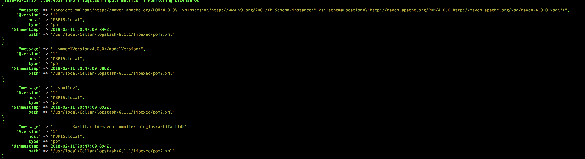

# Ingest xml file into Elasticsearch through logstash

## Problem statement

How can we push a xml file into elasticsearch in such a way that one xml file is cointained in one document or one record or elasticsesarch. However if one try to push any xml file as follow (file [here](./conf/logstash-xml-false.conf), elastic will create a record for each line :

```
input {
	file {
	    path => [ "/usr/local/Cellar/logstash/6.1.1/libexec/pom2.xml" ]
	    type => "pom"    
	}
}
filter { }
output {
    elasticsearch { 
       hosts => hosts => "http://${ELKMASTERHOSTNAME}:${ELKMASTERPORT}"
       index => "pom"
    }
  stdout { codec => rubydebug }
}
```

Then you can call logstash as follow :

```
bin/logstash -f logstash-xml-false.conf
```

here are few lines of the execution console :




Here is the result for few lines in kibana :


This is not really practical to dump each line of a xml file into one elastic record; it will still offer a good search capability on a dump of data but it is at cost. Let's have a look at how we can provide a better solution but first let's review the core principle of logstash.

## Logstash pipeline

Logstash is made of three parts : input, filter and output. In essence logstash works like a pipeline or a conduite to elastic. it means that in the case of a *text* file, each line of the file is considered as an individual record being push through the pipeline. Therefore each record will be process through the sequence **input -> filter -> output**.

## XML file

Any xml file is made of several lines, XML is just information wrapped in tags. 


- [logstash configuration file - xml input](./conf/logstash-pom-xml.conf)


